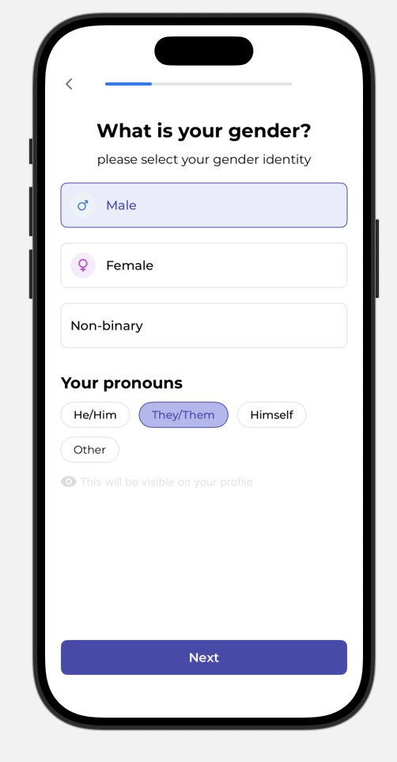
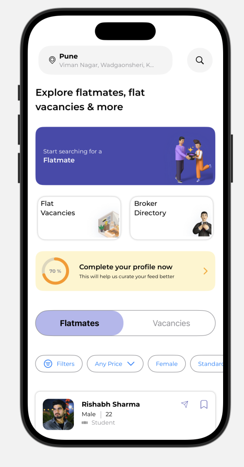

# 🏠 SwiftUI-FlatmateFindr-App

A modern, scalable SwiftUI-based mobile app that helps users find ideal flatmates. Built using clean MVVM architecture, Combine, SwiftUI Navigation, and a centralized design system. This app emphasizes reusability, maintainability, and fully native UI without third-party libraries.

---

## 🚀 Features

✅ 100% SwiftUI interface — no storyboards  
✅ Clean and scalable **MVVM architecture**  
✅ **Combine**-powered reactive data flow  
✅ Native **SwiftUI NavigationStack** for screen transitions  
✅ Custom-built **navigation router** for decoupled routing  
✅ Centralized color and font styling using `AppColor` & `AppFont`  
✅ Modular and **reusable views** (Cards, Lists, Filters, Loaders)  
✅ Dynamic UI layouts with `GeometryReader`  
✅ Reusable **ViewModifiers** for styling consistency  
✅ **Localization-ready** architecture (multi-language support)  
✅ Lightweight and fully open-source

---

## 🧰 Tech Stack

- **Language**: Swift 5.9+
- **UI**: SwiftUI (iOS 15+)
- **Architecture**: MVVM (Model-View-ViewModel)
- **Reactive Programming**: Combine
- **Routing**: Custom `Router` with enum-based paths
- **Design System**: Centralized fonts, colors, and spacings
- **Testing**: Unit-test ready ViewModels (mockable services)

---

## 📸 Screenshots

<table>
  <tr>
    <td></td>
    <td></td>
    <td></td>
  </tr>
</table>


---


## 📦 Installation

1. Clone the repository  
   ```bash
   git clone https://github.com/Ajaykumar1d/SwiftUI-FlatmateFindr-App.git
